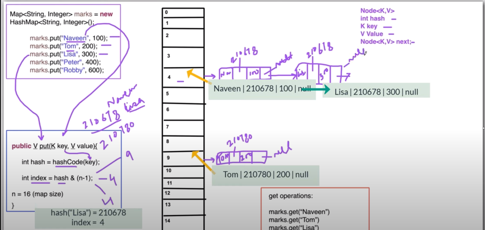

### Hash Map Concept

1. Hash map is an associative array data structure.
2. Store data in the form of <key, value> pair.
3. Hashing HashCode() coming from the object class
 Hashcode() ----> Hashing
4. same data(key, value) can be store

Map<String,Integer> marks = new HashMap<String,Integer>();

marks.put("Naveen, 100);  
marks.put("Tom, 200);  
marks.put("Lisa, 300);  
marks.put("Peter, 400);  
marks.put("Robby, 500);

| 0   |                   
|-----|
| 1   |  
| 2   |  
| 3   |  
| 4   |  
&#8593;

| Key    | int hash | value | next node address          |               
|--------|----------|-------|----------------------------|
 | Naveen | 210678   | 100   | null (This time i use null |

[ HashMap Best tutorial
](https://www.youtube.com/watch?v=SXfsBDTodpY&ab_channel=NaveenAutomationLabs)
